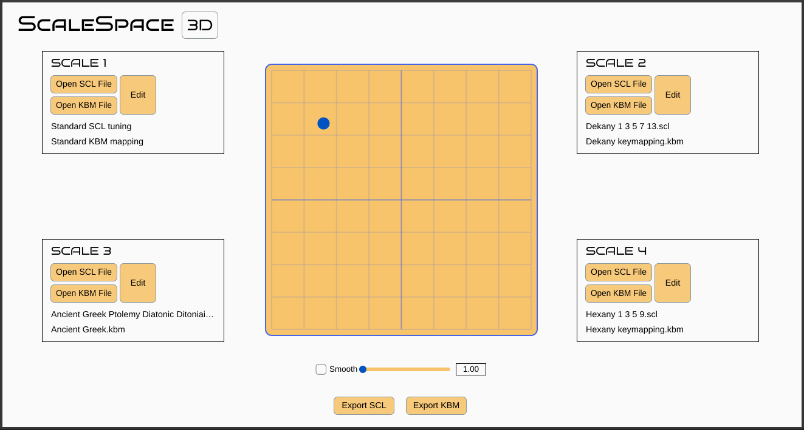
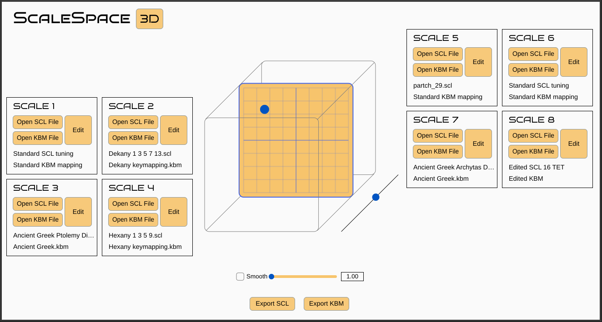
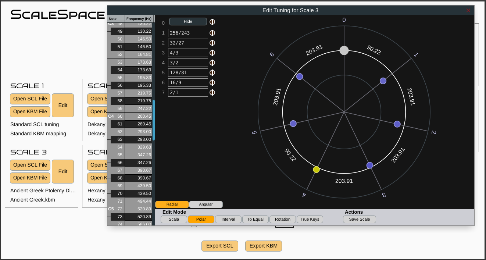

# Scale-Space

Scale-Space is an [MTS-ESP](https://github.com/ODDSound/MTS-ESP) master plugin, which allows the dynamic manipulation of the current scale by using a 2D or 3D slider to explore the 'scale space' between multiple scales.

# Settings

Each scale can be set with the Tuning Editor, or by loading a either a Scala scale file (.scl), keymapping file (.kbm) file, or both. Click "Open SCL File" or "Open KBM File" to choose the file. Files can also be dragged & dropped on to the scale boxes, or on to the Tuning Editor.

In 2D mode, the four corners of the XY slider represent each of the four scales. For example, moving the slider to the top left corner will set the current scale to Scale 1, and moving it to the bottom right corner will set the current scale to Scale 4. Different positions within the square will set the current scale to a different weighted average of the four scales.

 

In 3D mode, the eight corners of the 3D slider represent each of the eight scales. For example, moving the slider to the top left XY corner and moving the Z slider to the bottom left will set the current scale to Scale 1, and moving it to the bottom right XY corner while moving the Z axis to the top right will set the current scale to Scale 8. Different positions within the cube will set the current scale to a different weighted average of the eight scales.

 

Clicking anywhere on the XY pad or Z axis will immediately change the averaged scale. If 'Smooth' is set to on, the scale will glide continuously from one tuning to another. A higher setting on the Smooth slider means a longer glide time. Note that smoothing also causes a lag in the time taken for the tuning to change, even when the XY pad thumb is being dragged around manually.

Pressing the 'Edit' button for a scale opens the Tuning Editor for that scale. Scale-Space's Tuning Editor is a slightly modified version of [Surge XT's](https://github.com/surge-synthesizer/surge) Tuning Editor. Note that while the Tuning Editor is open, the tuning is still being interpolated, so unless the thumb is at the relevant corner of the square or cube for that tuning, any changes heard will be for the current mixed, interpolated tuning.

 

An .scl and .kbm file for the current interpolated scale, can be saved by by pressing the Export SCL and Export KBM buttons. To allow for any scale, the .scl file defines every MIDI note from 0 to 127 as a difference in cents from the reference note frequency. The .scl assumes that the reference note will be MIDI note 60, so the first listed pitch difference is assumed to be for MIDI note 61. The .kbm file sets the reference frequency at MIDI note 60, using the frequency of MIDI note 60 in the current scale. The .kbm file also sets key-for-key mapping.

# Notes

To use this plugin, you will need to install [libMTS.](https://github.com/ODDSound/MTS-ESP)

Scala scale files (.scl) and / or keymapping files (.kbm) can be used to set the scales. There is a large collection of .scl files at the [Scala Scale Archive.](https://huygens-fokker.org/microtonality/scales.html)

A collection of .scl and .kbm files can be found in the [Sevish Tuning Pack.](https://sevish.com/music-resources/#tuning-files)

# Credits
[JUCE Framework.](https://github.com/juce-framework/JUCE) AGPLv3 license.

[MTS-ESP.](https://github.com/ODDSound/MTS-ESP) 0BSD license.

[Surge Synthesizer Tuning Library.](https://github.com/surge-synthesizer/tuning-library) MIT license.

The Tuning Editor, and supporting code, is adapted from [Surge XT.](https://github.com/surge-synthesizer/surge) GPL-3.0 license.

[fmt.](https://github.com/fmtlib/fmt) [License.](https://github.com/fmtlib/fmt/blob/master/LICENSE)

[Bruno Ace Font](https://fonts.google.com/specimen/Bruno+Ace) designed by Astigmatic. [Open Font License.](https://scripts.sil.org/cms/scripts/page.php?site_id=nrsi&id=OFL)

[Bruno Ace SC Font](https://fonts.google.com/specimen/Bruno+Ace+SC) designed by Astigmatic. [Open Font License.](https://scripts.sil.org/cms/scripts/page.php?site_id=nrsi&id=OFL)

2D pad initally based on the XY pad from [aether.](https://github.com/Coconut-audio/aether) GPL-3.0 license.
